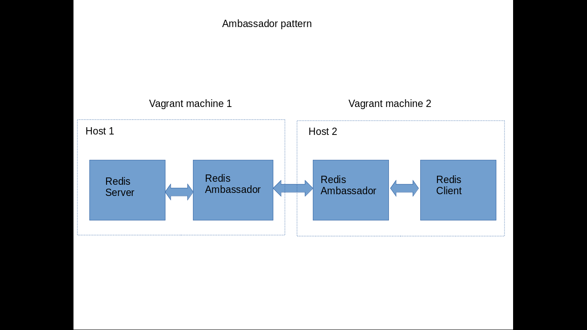

# Homework 4 - Advanced Docker

### Demo [video](www.youtube.com)

**File IO**: Create a container for a legacy application. Access to a file that the legacy app creates.

* I am creating an image called 'legacyimage' from ubuntu:14.04 image, which will echo "This is legacy application" to op.txt. I will be building this image using [Dockerfile](./File_IO/Dockerfile). Dockerfile contents are as follows:
	```
	from ubuntu:14.04
	RUN apt-get 		update		
	RUN apt-get install -y socat
	RUN echo "This is legacy application" > op.txt
	CMD socat -d -d TCP-LISTEN:9001,fork SYSTEM:'cat op.txt'
	```
	This image is built by command: `docker build -t legacyimage .`

* This built image is run in container named 'legacyApp', which will read the contents of op.txt created while building an image and put it on port 9001 using following command.

	`docker run -it --rm --name legacyappcontainer legacyimage`

* New linker container is created using docker run command and it is linked to legacyappcontainer by following command.

	`docker run -it --rm --name linkercontainer --link legacyappcontainer ubuntu:14.04 /bin/bash`

* This will open up a bash in newly created linkercontainer. We can see the linking with following command in docker host.

	`docker inspect -f "{{ .HostConfig.Links }}" linkercontainer`

* Going back to linkercontainer shell, first I need to install curl. Then I will curl to linked legacyApp container and port 9001.

	`curl legacyappcontainer:9001`


**Ambassador pattern**: Implement the remote ambassador pattern to encapsulate access to a redis container by a container on a different host.

* I have used couple of vagrant machines for this purpose, say Host1 and Host2. Both machines are having docker-compose preinstalled. I am using dbit/ubuntu-docker-fig image from vagrant boxes. So first Host1 is up by running.
	`vagrant init dbit/ubuntu-docker-fig; vagrant up`

	

* I have configured Host1 to be exposed on ip address 192.168.33.10 in [vagrantfile](./Ambassador_pattern/Host1/Vagrantfile). Inside this host, [docker-compose](./Ambassador_pattern/Host1/docker-compose.yml) file will run Redis server and redis ambassador image. Redis ambassador is linked to redis server through port `6379:6379` mapping. We run services redis-ambassador and redis-server with docker-compose with following command.

	`sudo docker-compose up -d`

* Host2 will run its own [docker-compose](./Ambassador_pattern/Host2/docker-compose.yml) file, which will run redis ambassador and redis client. On Host2 we run redis-client which will automatically run redis-ambassador in this host2 with following command.

	`sudo docker-compose run redis_client`

* Now we can see 4 containers running each for following: redis_server, redis_ambassador(Host1), redis_ambassador(Host2) and redis_client
	We can then get and set key values in redis_server from redis_client.
	```
	set somekey "DevOps"
	get somekey
	```

**Docker Deploy**: Extend the [deployment workshop](https://github.com/CSC-DevOps/Deployment) to run a docker deployment process.

* First we have to run the local registry and map it to port 5000 with following command.

	`docker run -d -p 5000:5000 --restart=always --name registry registry:2`

* Whenever any changes are commited [post-commit](./Docker_Deploy/post-commit) hook will build the image with this [dockerfile](./Docker_Deploy/Dockerfile). This image will deploy the dockerzed [simple node.js App](./Docker_Deploy/app) on port 8080. After that this image will be pushed into local respository within the [post-commit](./Docker_Deploy/post-commit) script only.

* For blue and green slices we export a variable say ROOT with deployment directory with following command:

	`export ROOT=home/chetanpawar0989/DevOps/HW4_Advanced_Docker/Docker_Deploy/deploy`

* We create folder blue.git and green.git and initialize them with bare repository with commands: `git init --bare`
[blue.git](./Docker_Deploy/blue-post-receive) and [green.git](./Docker_Deploy/green-post-receive) repos will have their post-receive hooks which would pull the localhost:5000/ncsu:latest image pushed in post-commit and wil run in blue-app and green-app containers respectively with linking their ports 8080 and 9090 respectively.

* In our source git repository we have added two remote links for the repository, blue and gree using commands:
	```
	git remote add blue "file://$ROOT/blue.git"
	git remote add green "file://$ROOT/green.git"
	```

* We can see the changes after pushing to respective remots
	```	
	git push blue master		# check on port 8080			
	git push green master		# check on port 9090	
	```